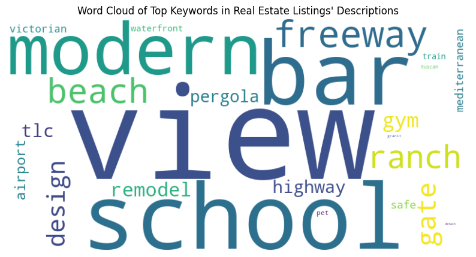

<table style="border-collapse: collapse;">
  <tr>
    <td style="text-align: left; border: none;">
      <h1 style="font-weight: bold;">California Real Estate Price Prediction</h1>
      
Using real estate listings collected in the first 6 months in 2021

    </td>
    <td style="border: none;">
      
    </td>
  </tr>
</table>

# Introduction
This is a capstone project submission for UC Berkeley School of Engineering and Haas School of Business' certification program in Machine Learning. 
### Topic: 
Using the real estate sales dataset for houses in California for 2021 January through July, identify a model and key features that can help predict prices for single family homes.
### Author: 
Vinay Jain [LinkedIn Profile](https://www.linkedin.com/in/vinay-jain-5151ba/), [Email Vinay](mailto:vinay.jn@gmail.com)

# Source code
## Data analysis
Data analysis of each of the attributes is detailed out in the [data analysis notebook](california_real_estate_price_predictor_data_analysis.ipynb)
## Data cleansing, feature engineering, modeling and feature importance
All of the key implementation details can be found in the [California Price Predictor notebook](california_real_estate_price_predictor.ipynb)
## Capstone presentation
Capstone presentation can be found [here](Capstone%20presentation.pptx)

# Data set information
## Source:
- Dataset is from Kaggle: https://www.kaggle.com/datasets/yellowj4acket/real-estate-california/data 
- This dataset shows real estate listing for California (US) for the first 7 months of 2021. Prices are listed in USD.

## Data inderstanding
<pre>
Data Set Characteristics:  Multivariate
Area: Real Estate/Housing
Attribute Characteristics: Real
Missing Values? None
</pre>

## Attribute information
There is one CSV file: RealEstate_California.csv.

There are a total of 35,389 records with 39 columns.
<pre>
 #   Column              Non-Null Count  Dtype  
---  ------              --------------  -----  
 0   sequence            35389 non-null  int64  
 1   id                  35389 non-null  object 
 2   stateId             35389 non-null  int64  
 3   countyId            35389 non-null  int64  
 4   cityId              35389 non-null  int64  
 5   country             35389 non-null  object 
 6   datePostedString    35386 non-null  object 
 7   is_bankOwned        35389 non-null  int64  
 8   is_forAuction       35389 non-null  int64  
 9   event               35100 non-null  object 
 10  time                35100 non-null  float64
 11  price               35389 non-null  float64
 12  pricePerSquareFoot  35389 non-null  float64
 13  city                35389 non-null  object 
 14  state               35389 non-null  object 
 15  yearBuilt           35389 non-null  int64  
 16  streetAddress       35388 non-null  object 
 17  zipcode             35364 non-null  float64
 18  longitude           35389 non-null  float64
 19  latitude            35389 non-null  float64
 20  hasBadGeocode       35389 non-null  int64  
 21  description         35110 non-null  object 
 22  currency            35389 non-null  object 
 23  livingArea          35389 non-null  float64
 24  livingAreaValue     35389 non-null  float64
 25  lotAreaUnits        35389 non-null  object 
 26  bathrooms           35389 non-null  float64
 27  bedrooms            35389 non-null  float64
 28  buildingArea        35389 non-null  float64
 29  parking             35389 non-null  int64  
 30  garageSpaces        35389 non-null  float64
 31  hasGarage           35389 non-null  int64  
 32  levels              35389 non-null  object 
 33  pool                35389 non-null  int64  
 34  spa                 35389 non-null  int64  
 35  isNewConstruction   35389 non-null  int64  
 36  hasPetsAllowed      35389 non-null  int64  
 37  homeType            35389 non-null  object 
 38  county              35389 non-null  object 
dtypes: float64(12), int64(14), object(13)
memory usage: 10.5+ MB
</pre>

## Data analysis
Extensive data analysis was conducted for all the 39 column. All of the data analysis can be found in this file: california_real_estate_price_predictor_data_analysis.ipynb

The final snapshot of the analysis is summarized in the table below:
<pre>
 0   sequence            35389 non-null  int64    x   Drop column due to its high uniqueness
 1   id                  35389 non-null  object   x   Drop column due to its high uniqueness
 2   stateId             35389 non-null  int64    x   Drop column since the data is for CA only
 3   countyId            35389 non-null  int64    x   Drop column in favor of zipcode as the location feature
 4   cityId              35389 non-null  int64    x   Drop column in favor of zipcode as the location feature
 5   country             35389 non-null  object   x   Drop column since the data is for only one county (US)
 6   datePostedString    35386 non-null  object   x   Drop all records older than '2021-01-01', then drop this column
 7   is_bankOwned        35389 non-null  int64    x   Drop records where value is 1 then drop this column
 8   is_forAuction       35389 non-null  int64    x   Drop records where value is 1 then drop this column
 9   event               35100 non-null  object   x   Drop records where 'event'='Listing removed' OR 'event'='Listed for rent'
 10  time                35100 non-null  float64  x   Drop column as specific time of listing is not helpful
 11  price               35389 non-null  float64  x   Keep records where price>0 and price <= upper fence ($2,399,870)
 12  pricePerSquareFoot  35389 non-null  float64  x   Drop this column because of a very weak correlation with price
 13  city                35389 non-null  object   x   Drop column in favor of cityId
 14  state               35389 non-null  object   x   Drop column in favor of stateId
 15  yearBuilt           35389 non-null  int64    x   Convert to categorical column
 16  streetAddress       35388 non-null  object   x   Drop column in favor of zipcode as the location feature
 17  zipcode             35364 non-null  float64  x   Convert to categorical column
 18  longitude           35389 non-null  float64  x   Drop column in favor of zipcode as the location feature
 19  latitude            35389 non-null  float64  x   Drop column in favor of zipcode as the location feature
 20  hasBadGeocode       35389 non-null  int64    x   Drop column as it has only one value (0)
 21  description         35110 non-null  object   x   Retain to perform NLP analysis
 22  currency            35389 non-null  object   x   Drop column as all data is in USD
 23  livingArea          35389 non-null  float64  x   Drop column in favor of livingAreaValue
 24  livingAreaValue     35389 non-null  float64  x   Drop records where livingAreaValue=0
 25  lotAreaUnits        35389 non-null  object   x   Retain as-is
 26  bathrooms           35389 non-null  float64  x   Drop records where bathrooms=0
 27  bedrooms            35389 non-null  float64  x   Drop records where bedrooms=0
 28  buildingArea        35389 non-null  float64  x   Drop column since a large majority of values are 0 (almost 15K)
 29  parking             35389 non-null  int64    x   Convert to bool column
 30  garageSpaces        35389 non-null  float64  x   Retain as-is
 31  hasGarage           35389 non-null  int64    x   Convert to bool column
 32  levels              35389 non-null  object   x   Consolidate all possible values into 4 distinct values
 33  pool                35389 non-null  int64    x   Convert to bool column
 34  spa                 35389 non-null  int64    x   Convert to bool column
 35  isNewConstruction   35389 non-null  int64    x   Drop records where isNewConstruction=1, drop the column
 36  hasPetsAllowed      35389 non-null  int64    x   Drop column since single family homes usually do not have such restriction
 37  homeType            35389 non-null  object   x   Retain records where 'homeType'='SINGLE_FAMILY' and then drop this column 
 38  county              35389 non-null  object   x   Drop column in favor of zipcode as the location feature
 </pre>

## Data cleanup
After conducting the data cleanup as identified in the Data Analysis section, we have a total 17,807 records with 15 columns:
<pre>
 #   Column           Non-Null Count  Dtype  
---  ------           --------------  -----  
 0   event            17807 non-null  object 
 1   price            17807 non-null  float64
 2   yearBuilt        17807 non-null  object 
 3   zipcode          17807 non-null  object 
 4   description      17710 non-null  object 
 5   livingAreaValue  17807 non-null  float64
 6   lotAreaUnits     17807 non-null  object 
 7   bathrooms        17807 non-null  float64
 8   bedrooms         17807 non-null  float64
 9   parking          17807 non-null  bool   
 10  garageSpaces     17807 non-null  float64
 11  hasGarage        17807 non-null  bool   
 12  levels           17807 non-null  object 
 13  pool             17807 non-null  bool   
 14  spa              17807 non-null  bool   
dtypes: bool(4), float64(5), object(6)
memory usage: 1.6+ MB
</pre>

## Feature Engineering
1. **'description' field was mined using NLTK** to look for specific keywords (for Features like 'hardwood floors', 'solar panels' or for Property Styles like 'victorian', 'contemporary' or for Property Conditions like 'renovated') that might help identify features of single family homes that are not captured in the individual columns. Keywords searched were:
  - **"Features"**: ['master', 'detached', 'waterfront', 'bonus room', 'solar panel', 'office', 'guest house', 'in law', 'granite', 'new roof', 'custom landscape', 'custom closet', 'backyard', 'back yard'],
  - **"Property_Condition"**: ['remodeled', 'renovated', 'designer', 'fixer upper', 'TLC', 'handyman special', 'model home'],
  - **"Location_Neighborhood"**: ['safe', 'cul de sac', 'gated', 'freeway', 'highway', 'golf course', 'beach', 'school', 'view', 'acre', 'secure', 'airport', 'train'],
  - **"Property_Style_Layout"**: ['ranch', 'colonial', 'victorian', 'mediterranean', 'contemporary', 'modern', 'tuscan', 'farmhouse'],
  - **"Amenities"**: ['pet', 'bar', 'pergola', 'furnished', 'community pool', 'gym', 'fireplace', 'deck'],
  - **"Terms"**: ['short sale', 'foreclosure', 'owner financing', 'seller financing', 'seller credit', 'cash offer', 'deed', 'association fee', 'motivated']

   These keywords were added as columns to the DataFrame after stemming and lemmatizing and each occurence of a keyword in the 'description' field (tokenized after converting to lowercase and removing punctuations) incremented the value in that column for that row.

  Here is a word cloud of the most prominently used keywords across all 'descriptions'. 

  

2. **Derived Features from existing data**:
   1. Age of the House: Calculate the age of the house by subtracting the year built from the current year (or a reference year=2021). Drop the ‘yearBuilt’ column since‘AgeOfHouse’ now represents the year built information.
   2. Living Area per Room: Divide the living area by the number of rooms to get a measure of space per room.
   3. Bath to Bedroom Ratio: bathrooms / bedrooms
   4. Garage to Bedroom Ratio: garageSpaces / bedrooms
   

3. **Drop columns** that could likely to increase collinearity. These were:
   1. yearBuilt - used in age of the house
   2. livingAreaValue - used in living area per room

4. **Encode categorical columns using One Hot Encoding**

## Models and their resulting metrics
GridSearchCV was used to perform hyperparameter tuning across:
1. Linear Regression with polynomail factors up to a degree=4
2. Ridge Regression
3. Lasso Regression
4. Gradient Descent
5. Neural network with 3 hidden layers

| Model                     | Training RMSE | Test RMSE | R-squared (Train) | R-squared (Test) | Fit Time (s) | Best Parameters |
|---------------------------|-------------:|----------:|------------------:|-----------------:|-------------:|-----------------|
| GradientBoostingRegressor |       313070 |    338684 |            0.5656 |           0.5071 |      132.84 | {'alpha': 0.9, 'ccp_alpha': 0.0, 'criterion': 'friedman_mse', 'init': None, 'learning_rate': 0.1, 'loss': 'squared_error', 'max_depth': 5, 'max_features': None, 'max_leaf_nodes': None, 'min_impurity_decrease': 0.0, 'min_samples_leaf': 1, 'min_samples_split': 2, 'min_weight_fraction_leaf': 0.0, 'n_estimators': 100, 'n_iter_no_change': 5, 'random_state': 42, 'subsample': 1.0, 'tol': 0.0001, 'validation_fraction': 0.2, 'verbose': 0, 'warm_start': False} |
| Lasso                     |       192422 |    223941 |            0.8359 |           0.7845 |       4.6979 | {'alpha': 5.0, 'copy_X': True, 'fit_intercept': True, 'max_iter': 1000, 'positive': False, 'precompute': False, 'random_state': 42, 'selection': 'cyclic', 'tol': 0.0001, 'warm_start': False} |
| Neural Network            |       160483 |    225695 |            0.8858 |           0.7811 |     291.001 | N/A |
| Ridge                     |       194859 |    223847 |            0.8317 |           0.7847 |       1.2051 | {'alpha': 0.5, 'copy_X': True, 'fit_intercept': True, 'max_iter': None, 'positive': False, 'random_state': 42, 'solver': 'auto', 'tol': 0.0001} |
| LinearRegression_Poly1    |       341489 |    351380 |            0.4831 |           0.4695 |       8.9724 | {'copy_X': True, 'fit_intercept': True, 'n_jobs': -1, 'positive': False} |
| LinearRegression_Poly2    |       541458 |    545900 |           -0.2994 |          -0.2805 |       1.9862 | {'copy_X': True, 'fit_intercept': False, 'n_jobs': -1, 'positive': False} |
| LinearRegression_Poly3    |       317795 |    344053 |            0.5524 |           0.4914 |       1.7184 | {'copy_X': True, 'fit_intercept': False, 'n_jobs': -1, 'positive': False} |
| LinearRegression_Poly4    |       312203 |  1361540 |            0.5680 |          -6.9655 |       2.2513 | {'copy_X': True, 'fit_intercept': False, 'n_jobs': -1, 'positive': False} |

**Best Model:** Ridge  
**Best Test RMSE:** 223847.0556

### Ridge model is the best predictor model (in terms of MSE (test), R-squared (test) and Fit time).

## Feature Importance Analysis

### Key Findings
1. **Bathrooms Reign Supreme**: The most important feature by far is the number of bathrooms. This reinforces the well-known fact that more bathrooms are strongly associated with price predictions.
2. **Space is Key**: The feature LivingAreaPerRoom, representing living area per room, has a significant importance score. It suggests that buyers value houses with ample space per room.
3. **Other Notable Factors**: Price change event, number of garage spaces, Bath to Bed ratio and number of bedrooms round up the top 10 impactful features.
4. **Location is Crucial**: Many zip codes show up as important features indicating the model has a high affinity to location.
5. **Gold nuggets in the 'description' field**: Its interesting to note that mention of beach and architectural styles like the ranch play a significant factor too.

### Interpreting the Results
- The high importance scores for bathrooms, LivingAreaPerRoom, and price change event are intuitive and align with common real estate knowledge.
- The significant influence of some zip codes, beaches and architectural styles highlights the importance of location, style and neighborhood factors.

### Here are the top features with their importance scores:
<pre>
                  Feature     Importance
0               bathrooms  128255.662613
1       LivingAreaPerRoom   42365.346779
2   event_Listed_for_sale   39260.450993
3      event_Price_change   33241.332212
4            garageSpaces   31936.837656
5       lotAreaUnits_sqft   25280.075635
6      lotAreaUnits_Acres   25280.075635
7      BathToBedroomRatio   22194.823543
8              event_Sold   20880.771485
9                bedrooms   16931.646762
10          zipcode_94080   11298.405487
</pre>

## Next Steps
For improving the model further, a few of the below steps can be taken:
  - Home prices are also impacted by a few other factors that are not available in the dataset available. 
  - Use Latitude and Longitude to identify additional location-based details such as: Crime rate, proximity to good schools, proximity to airports/train tracks, highways, shopping centers, etc.
  - Using street address, identify additional property related records – perhaps using government records - for property tax, association fees, number of acres of the land, specials fees/assessments, etc. that can play a significant portion in deciding the cost of house.
  - Using the listing date, identify if it is a buyer's market or seller’s market. Economic conditions may dictate influence on prices too.
  - Adding other such details in the mix will likely reduce the RMSE further down making it a better model in predicting house prices with higher confidence.

It's important to remember that these findings are based on the data and model used, and they might vary depending on the dataset and the model's parameters.

## Key learnings applied in the Capstone project include
- Data analysis
- Data cleansing
- Feature engineering
  - Natural Language Processing (NLTK, Tokenize, Stemming, Lemmatizing)
  - Feature derivations
  - Categorical value engineering using ColumnTransformers like OneHotEncoding
- Linear Regression with multiple polynomial factors, apply standard scaling
- Ridge Regression
- Lasso Regression
- Gradient Descent
- Compare models using metrics
- Apply hyperparameter tuning using GridSearchCV
- Feature importance derivation and definition
- Plot views using matplotlib, seaborn and plotly express libraries
- Able to interpret findings and document/showcase findings in business terms